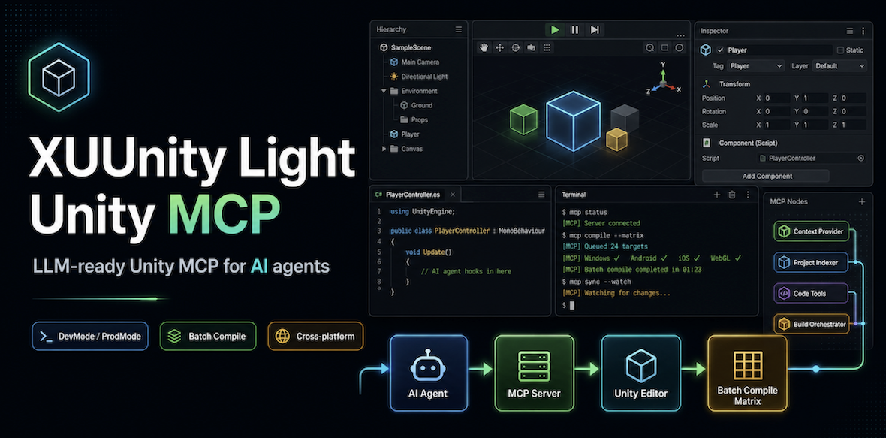

<div align="center">



<h1>XUUnity MCP<br><small>Local-first Unity MCP for compile checks, tests, scene validation, and console evidence.</small></h1>

<p>
  <a href="https://github.com/FoxsterDev/xuunity-mcp"></a>
  <a href="LICENSE"></a>
  
  
  
  
  <br>
  
  
  
  
  
  
  
  
  <br>
  <a href="#agent-quick-start">Agent Quick Start</a> |
  <a href="#manual-install">Manual Install</a> |
  <a href="#verify-existing-install">Verify Existing Install</a> |
  <a href="#ai-agent-setup-prompt">AI Setup Prompt</a> |
  <a href="docs/index.html">Pages Site</a> |
  <a href="docs/reference/FEATURES.md">Features</a> |
  <a href="#supported-clients">Client Docs</a> |
  <a href="SECURITY.md">Security</a> |
  <a href="docs/reference/COMPARISON.md">Comparison</a> |
  <a href="docs/agents/AGENT_WORKFLOWS.md">Agent Workflows</a><br>
  <sub>Independent open-source project · Not affiliated with or endorsed by Unity Technologies · Unity Terms of Service authorization not confirmed</sub>
</p>

</div>

---

## Why Use It

Use XUUnity MCP when you want a local-first, validation-first Unity MCP for
safe editor automation, not broad unrestricted editor mutation.

- compile checks without switching the active Unity build target
- EditMode and PlayMode tests with normalized result accounting
- scene snapshots, scene assertions, console tail, and Game View screenshots
- bounded scenario validation and request-journal recovery after editor reloads
- same-host multi-project routing for workstations with multiple Unity projects
- editor-only package, disabled by default, with no player-build footprint by default

Search positioning keywords for this repo:

- `xuunity mcp`
- `unity mcp`
- `lightweight unity mcp`
- `safe unity mcp`
- `validation-first unity mcp`
- `unity mcp for compile checks and tests`

---

## Quick Start

Choose one path first:

- [Agent Quick Start](#agent-quick-start) for AI-driven setup from a short prompt
- [Manual Install](#manual-install) for direct human setup
- [Verify Existing Install](#verify-existing-install) when the helper or client wiring may already exist

### Prerequisites

- Unity 2021.3 LTS+; the current release has live validation on Unity 2021.3,
  2022.3, and 6000.x. See [Status](docs/reference/STATUS.md).
- Python 3.10+
- one MCP client: [Claude Code](docs/clients/claude-code.md), [Claude Desktop](docs/clients/claude-desktop.md), [Cursor](docs/clients/cursor.md), [Rider](docs/clients/rider.md), [Windsurf](docs/clients/windsurf.md), [Antigravity IDE](docs/clients/antigravity.md), or a [Codex-style agent](docs/clients/codex.md) with the [Codex visual setup guide](docs/clients/codex-unity-mcp-setup.md)

Before running the helper, verify which Python it will use:

```bash
command -v python3
python3 --version
```

If your default `python3` is older than `3.10`, set `PYTHON` explicitly before
running `run_installed_or_refresh_xuunity_mcp.sh`, `run.sh`, or
`xuunity_light_unity_mcp.sh`.

On native Windows (PowerShell or cmd.exe):

```powershell
py -3 --version
# or: python --version
```

The `.cmd` and `.ps1` launcher flavors probe `py`, then `python`, then
`python3`, reject the Microsoft Store stub interpreter, and require Python
3.10+. Set `PYTHON` to a full `python.exe` path when the probe picks the wrong
interpreter.

Important:

- UI auto-review, sandbox auto-approval, or tool-level approval is not the same
  thing as user approval of setup mutations.
- An existing host-tools directory may be reused, but its helper files must not
  be executed until their version and `.source_root` have been compared with the
  requested release. Refresh stale helper files from the approved release source
  first; file existence alone does not mean the helper is current.

## Agent Quick Start

This section is the fast-path for AI agents that need to install MCP into a new
repo and run the first MCP command or EditMode tests correctly.

### Agent Defaults

Use this contract when the user gives a short request such as:

> [!IMPORTANT]
> Replace `/path/to/UnityProject` with the absolute path to your Unity project
> before sending the prompt. Example shape for macOS/Linux:
> `/absolute/path/to/MyGame`. On Windows, use an absolute drive-letter or UNC
> path.

```text
Set up XUUnity Light Unity MCP release v0.3.45 from the canonical repository
https://github.com/FoxsterDev/xuunity-mcp for /path/to/UnityProject, follow
https://github.com/FoxsterDev/xuunity-mcp/blob/v0.3.45/README.md. Before executing
an existing helper, compare its version and .source_root with v0.3.45 and refresh
stale files from that release. On native Windows, migrate only the XUUnity client
block to cmd.exe plus run_installed_or_refresh_xuunity_mcp.cmd. After any helper
or client-config change, restart or refresh the client, list the live MCP tools,
and run unity_status_summary. Require mcp_server_info.version=0.3.47 in that live
result. Only then run EditMode tests.
```

Agent defaults:

- treat the current host client that is executing the request as the default
  MCP wiring target unless the user explicitly names a different client
- treat the explicitly requested Unity project path as the only default setup
  target
- prefer Git UPM package mode unless the user explicitly asks for local package
  development
- reuse an existing helper install directory only after comparing its installed
  version and `.source_root` with the requested release; refresh stale files
  before executing the helper
- on native Windows, require `cmd.exe` plus
  `run_installed_or_refresh_xuunity_mcp.cmd`; an existing `bash`/`run.sh` client
  block requires an approved migration, not reuse

### Required Sequence

1. Read the release-pinned
   `https://github.com/FoxsterDev/xuunity-mcp/blob/v0.3.45/README.md`, its
   `INSTALL.md`, and the matching `docs/clients/*` guide for the current host
   client.
2. Run a non-mutating preflight:
   - confirm Python 3.10+
   - confirm Unity project structure
   - detect whether the request targets one Unity project or an entire workspace
   - compare the requested package release with the current manifest pin
   - inspect the installed helper version, `.source_root`, and refresh launcher
     before executing any existing helper
   - on native Windows, inspect the client block for the required native `.cmd`
     launcher
   - identify whether user-level client config such as `~/.codex/config.toml`
     or `~/.claude.json` would change
3. Produce a setup plan before mutating files:
   - for one requested Unity project, use `setup-plan --project-root
     "<UNITY_PROJECT_ROOT>"`
   - for a workspace or nested hub, use `setup-plan --workspace-root
     "<WORKSPACE_ROOT>" --recursive`
4. Show a short preflight review and wait for approval before any mutation,
   clone, installer run, manifest change, or user-level client config update.
5. After approval, apply setup only to the approved project roots.
6. Run `validate-setup`.
7. Run `ensure-ready --open-editor` when Unity is not already ready and wait
   for it to finish before checking status. Record whether the result reports
   `opened_by_host: true`.
8. Run the first status check:
   - use `request-status-summary` when the current client session cannot see
     newly wired MCP tools yet
   - use `unity_status_summary` as the first live MCP-tool smoke check after
     the client has loaded the server
9. After any helper or client-config change, restart or refresh the client,
   confirm that `xuunity_light_unity` appears in its MCP server list, list the
   live MCP tools, and run `unity_status_summary`; require
   `mcp_server_info.version=0.3.47`. Helper-only validation does
   not prove that the current MCP client session is connected.
10. When the user requested tests, run EditMode tests only after the live status
    summary is healthy.
11. If `ensure-ready --open-editor` opened Unity for this run
    (`opened_by_host: true`), restore editor state before the final report:
    - `xuunity_light_unity_mcp.sh restore-editor-state --project-root "<UNITY_PROJECT_ROOT>"`
    - `xuunity_light_unity_mcp.sh verify-editor-closed --project-root "<UNITY_PROJECT_ROOT>" --timeout-ms 0`
12. Finish with:
   - files changed
   - commands run
   - readiness result
   - first MCP command result
   - EditMode test result
   - whether a client restart is still required
   - whether Unity was restored/closed when opened by the helper

### Preflight Review Checklist

- detected current client
- intended client wiring target
- requested Unity project root
- any additional discovered Unity projects
- requested package release and current manifest pin
- installed helper version, source root, and refresh requirement
- current client launcher flavor
- whether setup will modify user-level client config
- files planned for mutation
- commands planned after approval
- whether the client must restart or refresh its MCP server list afterward

### Required Preflight Review Template

Every agent should show a short review block like this before `setup-apply`:

```text
Preflight review
- Current client: <detected client>
- Wiring target: <target client>
- Unity project root: <approved project root>
- Additional discovered Unity projects: <none or list>
- Existing helper directory: <present | missing>
- Requested package release: <v0.3.45>
- Current package pin: <missing | current | stale | custom>
- Helper state: <current | refresh required | missing> (<installed version and source root>)
- Client launcher: <native/current | migration required>
- Planned project file changes: <manifest, bridge config, lockfile, none>
- Planned user-level config changes: <exact file paths or none>
- Restart or refresh required after mutation: <yes/no and which client>
- Required live proof after restart: <server listed, tools listed, unity_status_summary healthy with mcp_server_info.version=0.3.47>
- Planned commands after approval: <setup-apply, validate-setup, ensure-ready, request-status-summary, unity_status_summary after reload, ...>

Do not run setup-apply, installer commands, helper sync, or client config edits
until the user explicitly approves this review.
```

### Safe Inspect Before Approval

- reading docs
- checking Python and Unity versions
- `setup-plan` from this wrapper, which must not refresh or write the installed
  helper
- `uninstall-plan` from this wrapper, which must not refresh, write, or remove
  the installed helper
- reading manifest, lockfile, and client config
- topology inspection

### Mutating Actions That Require Approval

- `git clone`
- installer runs
- `setup-apply`
- `uninstall-apply`
- `install-test-framework`
- manifest or lockfile edits
- user-level client config updates
- helper install removal
- `devmode` or `prodmode`

### Guided Setup Wizard

For one explicitly requested Unity project, produce a non-mutating plan first:

```bash
bash xuunity_light_unity_mcp.sh setup-plan \
  --project-root /path/to/UnityProject > /tmp/xuunity-setup-plan.json

# Stop here. Review the plan with the user before continuing.
bash xuunity_light_unity_mcp.sh setup-apply \
  --plan-file /tmp/xuunity-setup-plan.json \
  --project-root /path/to/UnityProject \
  --yes

bash xuunity_light_unity_mcp.sh validate-setup \
  --project-root /path/to/UnityProject
```

Native Windows quickstart from PowerShell uses the `.cmd` launcher (immune to
ExecutionPolicy) with `.\` and `$env:TEMP`:

```powershell
.\xuunity_light_unity_mcp.cmd setup-plan --project-root "C:\path with spaces\UnityProject" > "$env:TEMP\xuunity-setup-plan.json"

# Stop here. Review the plan with the user before continuing.
.\xuunity_light_unity_mcp.cmd setup-apply --plan-file "$env:TEMP\xuunity-setup-plan.json" --project-root "C:\path with spaces\UnityProject" --yes
.\xuunity_light_unity_mcp.cmd validate-setup --project-root "C:\path with spaces\UnityProject"
.\xuunity_light_unity_mcp.cmd ensure-ready --project-root "C:\path with spaces\UnityProject" --open-editor
```

The same commands from `cmd.exe` drop the `.\` prefix and use `%TEMP%`:

```bat
xuunity_light_unity_mcp.cmd setup-plan --project-root "C:\path with spaces\UnityProject" > "%TEMP%\xuunity-setup-plan.json"

REM Stop here. Review the plan with the user before continuing.
xuunity_light_unity_mcp.cmd setup-apply --plan-file "%TEMP%\xuunity-setup-plan.json" --project-root "C:\path with spaces\UnityProject" --yes
xuunity_light_unity_mcp.cmd validate-setup --project-root "C:\path with spaces\UnityProject"
xuunity_light_unity_mcp.cmd ensure-ready --project-root "C:\path with spaces\UnityProject" --open-editor
```

On native Windows, prefer `.cmd` for setup commands. PowerShell `.ps1` wrappers
can be blocked by ExecutionPolicy — stock Windows PowerShell 5.1 defaults to
`Restricted`, so run the `.ps1` flavor as
`powershell -NoProfile -ExecutionPolicy Bypass -File .\xuunity_light_unity_mcp.ps1 <command> ...`
when you need it directly. Git Bash is not the recommended setup route because
native Windows paths with spaces can cross an extra shell argument boundary
before Python receives them.

For flat hubs, mixed-version hubs, or nested repositories, scan the workspace
first and require an explicit target selection before `setup-apply`:

```bash
bash xuunity_light_unity_mcp.sh setup-plan \
  --workspace-root /path/to/workspace \
  --recursive > /tmp/xuunity-setup-plan.json

# Stop here. Review the plan. Then apply only to the intended Unity project roots.
bash xuunity_light_unity_mcp.sh setup-apply \
  --plan-file /tmp/xuunity-setup-plan.json \
  --project-root /path/to/UnityProject \
  --yes
```

The core MCP package works without `com.unity.test-framework`. Test operations
are an optional capability. To enable them explicitly:

```bash
bash xuunity_light_unity_mcp.sh install-test-framework \
  --project-root /path/to/UnityProject \
  --yes
```

Prefer this before opening or restarting Unity. The host helper mutates
`Packages/manifest.json` offline, then Unity resolves the package graph during
normal startup.

The helper recommends `com.unity.test-framework@1.1.33` for Unity 2021/2022 and
`@1.5.1` for Unity 6000+, while the capability gate remains `>= 1.1.33`.

### Guided Uninstall Wizard

Use `uninstall-plan` before any removal. It prints structured JSON and a
human-readable `preferred_review_summary`.

Project-only cleanup makes one Unity project look not yet set up while
keeping current-user client wiring and helper installs:

```bash
bash xuunity_light_unity_mcp.sh uninstall-plan \
  --mode project-only-cleanup \
  --project-root /path/to/UnityProject > /tmp/xuunity-uninstall-plan.json

# Stop here. Review the plan with the user before continuing.
bash xuunity_light_unity_mcp.sh uninstall-apply \
  --plan-file /tmp/xuunity-uninstall-plan.json \
  --yes
```

Project-only mode removes only the approved project-level MCP package dependency,
the matching packages-lock entry, and `Library/XUUnityLightMcp` bridge state
from the selected Unity project. It keeps `~/.codex/config.toml`,
`~/.claude.json`, and helper installs such as
`~/.codex-tools/xuunity-mcp`.

Full reset for the current user removes the selected current-user client
wiring and helper install in addition to optional project cleanup:

```bash
bash xuunity_light_unity_mcp.sh uninstall-plan \
  --mode full-reset-current-user \
  --project-root /path/to/UnityProject \
  --client auto > /tmp/xuunity-uninstall-plan.json

# Stop here. Review exact project, user config, and helper removals.
bash xuunity_light_unity_mcp.sh uninstall-apply \
  --plan-file /tmp/xuunity-uninstall-plan.json \
  --yes
```

On native Windows run the same uninstall commands through the `.cmd` launcher
with `$env:TEMP` (PowerShell) or `%TEMP%` (cmd.exe) plan paths:

```powershell
.\xuunity_light_unity_mcp.cmd uninstall-plan --mode project-only-cleanup --project-root "C:\path with spaces\UnityProject" > "$env:TEMP\xuunity-uninstall-plan.json"

# Stop here. Review the plan with the user before continuing.
.\xuunity_light_unity_mcp.cmd uninstall-apply --plan-file "$env:TEMP\xuunity-uninstall-plan.json" --yes
```

Use `--client codex|claude_code|cursor|windsurf|claude_desktop` when the
current client cannot be detected. Full reset removes only the
`xuunity_light_unity` block from the selected user config file; it does not
delete the whole config file or unrelated MCP servers. Known helper installs
for other clients are kept unless the plan is created with
`--include-other-client-helpers`.

For workspace or nested project contexts, pass `--workspace-root` and
`--recursive` only to report additional discovered Unity projects. The uninstall
flow mutates only explicit `--project-root` values and never silently removes
setup from sibling Unity projects.

Suggested short prompt for agents:

```text
Remove XUUnity Light Unity MCP from <UNITY_PROJECT_ROOT> in project-only cleanup mode.
Read README.md and INSTALL.md, run uninstall-plan --mode project-only-cleanup
--project-root "<UNITY_PROJECT_ROOT>", show the preflight review, wait for
approval, then run uninstall-apply --plan-file <reviewed plan> --yes.
```

For a current-user reset:

```text
Fully reset XUUnity Light Unity MCP for the current user. Run uninstall-plan
--mode full-reset-current-user, include --project-root only if a Unity project
was named, show exact user config/helper removals, wait for approval, then run
uninstall-apply with the reviewed plan.
```

### AI Agent Setup Prompt

Copy this prompt into your coding agent from the Unity project you want to
connect. Replace the placeholders before running it.

```text
Configure XUUnity Light Unity MCP for this Unity project and optionally run the
first requested MCP operation after setup.

Inputs:
- Canonical source repository: https://github.com/FoxsterDev/xuunity-mcp
- Required release: v0.3.45
- Release README: https://github.com/FoxsterDev/xuunity-mcp/blob/v0.3.45/README.md
- Unity project root: <absolute path to the Unity project>
- Workspace root: <absolute path to workspace; may equal the project root>
- First operation after setup: <optional, for example EditMode tests, health check, compile, or none>

Rules:
- Read the release-pinned README above, its INSTALL.md, and the matching
  docs/clients/* guide before editing files.
- On native Windows, run every `bash xuunity_light_unity_mcp.sh ...` command
  below as `.\xuunity_light_unity_mcp.cmd ...` from PowerShell (or
  `xuunity_light_unity_mcp.cmd ...` from cmd.exe), write plan files to
  "$env:TEMP\xuunity-setup-plan.json" instead of /tmp, and keep every project
  path quoted. Native Windows client config must use `cmd.exe` and
  `run_installed_or_refresh_xuunity_mcp.cmd`, never `bash` plus `run.sh`.
- Use the current host client that is running this request as the default MCP
  wiring target unless the user explicitly requests another client.
- Install the required tagged Git UPM release unless the user explicitly
  requests local package development.
- Reuse an existing helper install directory only after checking its installed
  version, `.source_root`, and refresh launcher against v0.3.45. Do not execute
  stale helper files; refresh them from the approved v0.3.45 source first.
- Preserve existing config. Merge the `xuunity_light_unity` server block; do
  not overwrite unrelated MCP servers, editor settings, or package entries. On
  native Windows, replace only an existing XUUnity `bash`/`run.sh` block with
  the native `cmd.exe`/`.cmd` block after approval; do not append a duplicate.
- Keep the package editor-only. Do not add runtime/player dependencies.
- Treat `com.unity.test-framework` as optional. Install or upgrade it only
  after explicit approval when the requested post-setup operation requires test
  capability.
- Ask before cloning the repo locally, running mutating installer steps,
  editing user-level client config, mutating manifests or lockfiles, changing
  more than one discovered Unity project, or doing destructive git/process
  actions.

Required procedure:
1. Confirm Python 3.10+, Unity project structure, current client, workspace
   topology, current package pin, installed helper version/source, and client
   launcher flavor.
2. Use the canonical source repository
   https://github.com/FoxsterDev/xuunity-mcp. If its v0.3.45 source is missing
   locally, ask before cloning it outside the Unity Assets folder and treat it
   as <MCP_REPO_ROOT>.
3. Produce a non-mutating setup plan from <MCP_REPO_ROOT>. `setup-plan` must
   not clone, run the installer, sync helper files, edit manifests, or change
   user-level client config:
   - for one requested Unity project:
     bash xuunity_light_unity_mcp.sh setup-plan --project-root "<UNITY_PROJECT_ROOT>" > /tmp/xuunity-setup-plan.json
   - for a workspace or nested hub:
     bash xuunity_light_unity_mcp.sh setup-plan --workspace-root "<WORKSPACE_ROOT>" --recursive > /tmp/xuunity-setup-plan.json
4. Show a short preflight review with:
   - detected current client
   - intended wiring target
   - requested Unity project root
   - additional discovered Unity projects
   - requested v0.3.45 package release and current manifest pin
   - installed helper version/source and whether refresh is required
   - current client launcher and whether native Windows migration is required
   - files that will change, including user-level config
   - whether the client must restart or refresh after the change
   - commands that will run after approval
5. Wait for approval before cloning, installer runs, helper sync, client
   wiring, setup-apply, manifest edits, lockfile edits, or user-level config
   changes.
6. After approval, refresh the host helper whenever its version/source does not
   match v0.3.45. Reuse the install directory, not stale files:
   - POSIX: `bash init_xuunity_light_unity_mcp.sh`
   - native Windows Codex: set
     `XUUNITY_LIGHT_UNITY_MCP_INSTALL_TARGET=codex`, then run
     `.\xuunity_light_unity_mcp.cmd server-help` from the v0.3.45 source
7. Apply the approved plan only to the approved Unity project roots:
   bash xuunity_light_unity_mcp.sh setup-apply --plan-file /tmp/xuunity-setup-plan.json --project-root "<UNITY_PROJECT_ROOT>" --yes
8. Wire the selected client using templates/clients/ or the matching
   docs/clients guide.
9. If the requested post-setup operation needs tests and the plan reports
   missing or too-old Test Framework support, ask for approval and then run:
   bash xuunity_light_unity_mcp.sh install-test-framework --project-root "<UNITY_PROJECT_ROOT>" --yes
10. Verify readiness:
    bash xuunity_light_unity_mcp.sh validate-setup --project-root "<UNITY_PROJECT_ROOT>"
    bash xuunity_light_unity_mcp.sh ensure-ready --project-root "<UNITY_PROJECT_ROOT>" --open-editor
    Record whether the readiness result reports `opened_by_host: true`.
    bash xuunity_light_unity_mcp.sh request-status-summary --project-root "<UNITY_PROJECT_ROOT>" --timeout-ms 5000
11. After any helper or client-config change, restart or refresh the client now.
    Confirm that `xuunity_light_unity` appears in the MCP server list, list its
    live tools, and run `unity_status_summary`. Treat that status call as the
    canonical first live MCP-tool smoke-check. Helper-only
    `request-status-summary` is not proof that the current MCP client session is
    connected. Verify `unity_capabilities` and `unity_health_probe` after the
    live status summary is healthy.
12. If a post-setup operation was requested, run it only after the status
    summary is healthy.
13. If `ensure-ready --open-editor` opened Unity for this run
    (`opened_by_host: true`), restore editor state before the final report:
    bash xuunity_light_unity_mcp.sh restore-editor-state --project-root "<UNITY_PROJECT_ROOT>"
    bash xuunity_light_unity_mcp.sh verify-editor-closed --project-root "<UNITY_PROJECT_ROOT>" --timeout-ms 0
14. Finish with a concise report listing files changed, commands run, readiness
    verification, the first MCP command result, any requested post-setup
    operation result, helper/package version alignment, Windows launcher
    migration state, restart completion, live tool/status proof, and whether
    Unity was restored/closed when opened by the helper. If restart/live proof
    is still pending, report `MCP client connection unverified`, not setup
    complete. Also state whether any failing compile or test result is an MCP
    setup failure or a project runtime failure.
```

## Manual Install

### 1. Install The Unity Package

In Unity: `Window > Package Manager > + > Add package from git URL...`

> Tip
>
> ```text
> https://github.com/FoxsterDev/xuunity-mcp.git?path=/packages/com.xuunity.light-mcp#v0.3.47
> ```

Or add it directly to `Packages/manifest.json`:

```json
{
  "dependencies": {
    "com.xuunity.light-mcp": "https://github.com/FoxsterDev/xuunity-mcp.git?path=/packages/com.xuunity.light-mcp#v0.3.47"
  }
}
```

Local package source for MCP development:
`file:/absolute/path/to/xuunity-mcp/packages/com.xuunity.light-mcp`.
Keep Git UPM as the default project state. Switch to the local `file:` source
only through explicit `devmode`.
OpenUPM is planned; use Git UPM until the package is published there.

When changing the project package pin, update the installed host MCP helper from
the same source line before validation. A package bump is not complete if Unity
uses a newer `com.xuunity.light-mcp` package while the client still launches an
older local `server.py`.

For MCP client configs, use `run_installed_or_refresh_xuunity_mcp.sh` as the
server command. The installer writes this launcher into the selected install
directories and records the public source checkout in `.source_root`. On client
startup it compares the installed neutral helper with
`packages/com.xuunity.light-mcp/package.json` from that public source checkout,
refreshes the host helper with
`init_xuunity_light_unity_mcp.sh --target both --force` when stale, and then
delegates to the installed low-level `run.sh` or `run.cmd` launcher.

This refresh is source-relative, not an update-to-latest service. If
`.source_root` still points at an older checkout, the old helper can consider
itself current. Before executing an existing helper for a v0.3.45 setup, compare
its installed version and `.source_root` with the approved v0.3.45 source and
refresh it from that source when they differ.

### 2. Install The Host MCP Helper

```bash
bash init_xuunity_light_unity_mcp.sh
```

Enable the bridge for one Unity project without changing package mode:

```bash
bash init_xuunity_light_unity_mcp.sh \
  --project-root /path/to/UnityProject \
  --enable-project
```

The installer writes the refresh-before-run launcher plus Unix and Windows
fallback launchers: `run_installed_or_refresh_xuunity_mcp.sh`,
`run_installed_or_refresh_xuunity_mcp.py`,
`run_installed_or_refresh_xuunity_mcp.cmd`, `run.sh`, `run.cmd`, and `run.ps1`.

If a helper directory already exists under `~/.codex-tools`,
`~/.claude-tools`, or another explicit host-tools path, reuse the directory only
after the version/source check above. Never execute stale helper files merely
because `server.py` or a launcher exists.

For local MCP package iteration, switch package mode explicitly:

```bash
bash xuunity_light_unity_mcp.sh devmode --project-root /path/to/UnityProject
```

To switch back to the published Git-backed source:

```bash
bash xuunity_light_unity_mcp.sh prodmode --project-root /path/to/UnityProject
```

### 3. Connect Your Client

Use a ready-made client template. If the destination file already exists, merge
the `xuunity_light_unity` server block instead of overwriting unrelated MCP
servers.

```bash
# Claude Code project scope
cp templates/clients/claude-code/.mcp.json .mcp.json

# Cursor project scope
mkdir -p .cursor
cp templates/clients/cursor/mcp.json .cursor/mcp.json
```

Native Windows templates are included next to the Unix templates as
`.windows.json` files.

On native Windows, an existing XUUnity client block that uses `bash`, `run.sh`,
or a WSL path is a migration requirement. After approval, replace only that
XUUnity block with `cmd.exe` plus
`run_installed_or_refresh_xuunity_mcp.cmd`; preserve unrelated client settings
and MCP servers, and do not append a duplicate block.

When running the wrapper directly, the host helper install target can be pinned
with `XUUNITY_LIGHT_UNITY_MCP_INSTALL_TARGET=codex|claude|neutral|auto`.
`auto` prefers the current client context, then an existing neutral helper,
then existing Claude/Codex helpers.

### 4. Verify Connection

```bash
bash xuunity_light_unity_mcp.sh validate-setup \
  --project-root /path/to/UnityProject

bash xuunity_light_unity_mcp.sh ensure-ready \
  --project-root /path/to/UnityProject \
  --open-editor

bash xuunity_light_unity_mcp.sh request-status-summary \
  --project-root /path/to/UnityProject
```

Run these helper commands sequentially; do not start the status check before
`ensure-ready` finishes. If the current client session has not hot-reloaded the
new MCP server yet, `request-status-summary` is only helper-side verification.
After any helper or client-config change, restart or refresh the client, confirm
that `xuunity_light_unity` is listed, list its live tools, and run
`unity_status_summary`. Only that live tool call proves the current MCP client
session is connected. After it reports a healthy bridge, confirm
`unity_capabilities` and `unity_health_probe` before moving on to tests or
builds. Until then, report `MCP client connection unverified`.

If `ensure-ready --open-editor` reports `opened_by_host: true`, the install or
test workflow owns that editor session. Before the final report, restore it:

```bash
bash xuunity_light_unity_mcp.sh restore-editor-state \
  --project-root /path/to/UnityProject

bash xuunity_light_unity_mcp.sh verify-editor-closed \
  --project-root /path/to/UnityProject \
  --timeout-ms 0
```

Install success means:

- `validate-setup` reports a ready configuration
- `ensure-ready` brings the editor to a healthy bridge state
- `request-status-summary` may report helper-side readiness, but is not the
  client-connection proof
- after any helper or config change, the client has restarted or refreshed,
  lists `xuunity_light_unity` and its live tools, and `unity_status_summary`
  reports a healthy bridge
- `unity_capabilities` and `unity_health_probe` succeed

If those checks pass but a later compile or test run fails, treat that as a
Unity project or runtime failure unless the failure explicitly points back to
bridge readiness, package import, or unsupported capability.

## Verify Existing Install

Use this path when the helper, client wiring, or package may already exist:

1. compare the requested package release, manifest pin, installed helper
   version, and `.source_root` before executing the existing helper
2. inspect the client config instead of rewriting it blindly; on native
   Windows, migrate `bash`/`run.sh` to the native `.cmd` block after approval
3. refresh stale helper files from the approved release source
4. run `validate-setup`
5. run `ensure-ready --open-editor` only if Unity is not already ready
6. run `request-status-summary` first if the client has not loaded the MCP
   server yet, then restart or refresh the client and run `unity_status_summary`
   as the first live smoke-check
7. list the live MCP tools and do not call setup complete until the live status
   succeeds
8. if `ensure-ready` opened Unity (`opened_by_host: true`), run
   `restore-editor-state` and verify the editor is closed before finishing

This avoids duplicate MCP server blocks, unnecessary repo clones, and silent
rewrites of user-level config, while returning helper-opened editor sessions to
their previous state.

Then try:

```text
Use XUUnity Light Unity MCP to check this Unity project health, compile Android
player scripts, and report the first actionable failure with artifact paths.
```

For a clean-project end-to-end Android smoke, including Git-default package
install, bridge readiness, and a regular Unity batch APK build:

```bash
templates/smoke/run_clean_project_android_apk_smoke.sh
```

If the selected Unity editor does not have Android Build Support installed but
you still want MCP-only readiness evidence, allow the runner to skip the APK
lane explicitly:

```bash
templates/smoke/run_clean_project_android_apk_smoke.sh --allow-no-android
```

The clean-project smoke runner is bash-only today (macOS, Linux, or Windows Git
Bash). On native Windows, use the Guided Setup Wizard `.cmd` flow plus
`validate-setup` and `ensure-ready --open-editor` as the equivalent readiness
evidence.

---

## Supported Clients

- [Claude Code](docs/clients/claude-code.md)
- [Claude Desktop](docs/clients/claude-desktop.md)
- [Cursor](docs/clients/cursor.md)
- [Rider](docs/clients/rider.md)
- [Windsurf](docs/clients/windsurf.md)
- [Antigravity IDE](docs/clients/antigravity.md)
- [Codex-style agents](docs/clients/codex.md) ([visual setup](docs/clients/codex-unity-mcp-setup.md))
- custom stdio MCP clients

Optional: connect XUUnity MCP to Codex/Codex-style clients when you want Codex
to validate Unity status, compile, tests, and setup directly from the chat. Use
this only on trusted local projects. If you also use Rider or VS Code MCP,
avoid running concurrent commands against the same Unity project.

Manual macOS/Linux and Windows configs live in `templates/clients/`.

<details>
<summary><strong>Features And Tools</strong></summary>

Popular MCP tools:

`xuunity_setup_plan` | `xuunity_setup_apply` | `xuunity_setup_validate` |
`xuunity_uninstall_plan` | `xuunity_uninstall_apply` |
`unity_license_capabilities` |
`unity_status_summary` | `unity_capabilities` | `unity_health_probe` |
`unity_console_tail` | `unity_console_grep` | `unity_loading_timing` |
`unity_scene_snapshot` | `unity_scene_open` | `unity_scene_assert` |
`unity_compile_player_scripts` | `unity_compile_matrix` |
`unity_compile_build_config_matrix` | `unity_tests_run_editmode` |
`unity_tests_run_playmode` | `unity_playmode_state` | `unity_playmode_set` |
`unity_build_player` |
`unity_game_view_configure` | `unity_game_view_screenshot` |
`unity_scenario_validate` | `unity_scenario_run_and_wait` |
`unity_request_final_status` | `unity_project_refresh` |
`unity_project_action_list` | `unity_project_action_invoke` |
`unity_artifact_register` | `unity_artifact_write_report` |
`unity_package_install_test_framework` | `unity_edm4u_resolve` |
`unity_sdk_dependency_verify`

Host helper commands include `setup-plan`, `setup-apply`, `uninstall-plan`,
`uninstall-apply`, `validate-setup`, `install-test-framework`,
`license-capabilities`, `ensure-ready`, `verify-editor-closed`,
`request-editor-quit --wait-for-exit`, `restore-editor-state`,
`recover-editor-session`, `batch-compile`, `batch-compile-matrix`,
`batch-editmode-tests`, `batch-build-config-compile-matrix`,
`batch-build-player`, `project-action-list`, `project-action-invoke`,
`project-hook-scaffold`, `request-scene-open`, `request-console-grep`,
`request-loading-timing`, `artifact-register`,
`artifact-write-report`, `artifact-probe`, `devmode`, and `prodmode`.

Scenario JSON may use Unity-native `project_action` steps for catalog-backed
project actions. Unity resolves `project_actions.yaml`, enforces mutation
approval, and executes the matching `project_defined_hook`; the host wrapper
also performs the same normalization before dispatch as an early diagnostic.
Scenario JSON may also use `scene_open` with `scenePath` to make boot-flow and
scene-normalization validation independent of the editor's currently open
scene; dirty scene discard must be requested explicitly.
`unity_scenario_run_and_wait` returns a compact decision envelope by default;
use `includeFullPayload=true` or the emitted `full_payload_tool_arguments` when
asserting raw per-step `payload_json`, `hook_name`, or parity-fixture fields.
When full scenario output is requested, duplicated `run_start.steps` are omitted
by default; pass `includeStepPayloads=true` / `--include-step-payloads` only
when the launch-time step copy itself is under test.
`unity_status_summary` also defaults to a compact polling summary; use
`includeFullPayload=true` when you need nested discovery, transport,
state-group, timing, or artifact details.
`ensure-ready` defaults to a compact readiness envelope; pass
`--include-full-payload` for full discovery, package import, launch, and
lifecycle evidence.
Refresh, compile, and direct test MCP tools also return compact operation
summaries by default; pass `includeFullPayload=true` when you need full
`_xuunity_lifecycle` snapshots for transport or lifecycle debugging.
Use `request-console-grep --source editor_log` or
`unity_console_grep` with `source=editor_log` when log presence must survive
Unity Console clear-on-play or ring-buffer eviction.

See [FEATURES.md](docs/reference/FEATURES.md) for maturity levels and implementation evidence.

</details>

<details>
<summary><strong>Package Mode, Troubleshooting, And Security</strong></summary>

`devmode` is for local MCP package edits:
`bash xuunity_light_unity_mcp.sh devmode --project-root /path/to/UnityProject`.

`prodmode` is for published Git-pinned package state:
`bash xuunity_light_unity_mcp.sh prodmode --project-root /path/to/UnityProject`.

Troubleshooting:

- Server not found: run `bash init_xuunity_light_unity_mcp.sh` again.
- Bridge disabled: run the installer with `--project-root` and `--enable-project`.
- Unity not ready: run `ensure-ready --open-editor` before validation tools.
- Package changes not visible: prefer reopening Unity so it resolves the
  manifest from a clean startup; use `unity_project_refresh` for an already
  healthy bridge.
- Test operations unavailable: run `validate-setup --include-tests`; if the
  Test Framework capability is missing, install it explicitly with the host
  `install-test-framework --yes` helper before opening Unity. Use the MCP tool
  `unity_package_install_test_framework` with `approve: true` only when the
  bridge is already healthy and an in-editor Package Manager mutation is
  intentional.
  If Test Framework is already declared but too old, the same command upgrades
  only that dependency after approval. If Unity 6000 already has `1.1.33`,
  tests may run, but setup reports an optional upgrade recommendation to
  `1.5.1`.
- Batchmode unavailable: run
  `license-capabilities --project-root <project> --refresh --timeout-ms 30000`.
  Batch helpers default to `--batch-fallback-mode auto`: if batchmode is blocked
  by a known license, Hub, account, Unity version, headless, or session condition
  and GUI fallback is viable, the MCP runs the equivalent GUI lane, reports
  `effective_execution_lane=gui`, and should be treated as successful command
  completion when the Unity outcome passed. The `batch-*` name describes the
  closed-project validation workflow, not a guarantee that the effective lane
  stayed in Unity batchmode.
  Use `--batch-fallback-mode require-batch` when a CI or release lane must fail
  unless real Unity batchmode is proven.
  Use `--output compact` when an operator only needs the batch decision summary
  and artifact pointers; the default `--output full` keeps the legacy command
  vector and nested payload for deep debugging.
- Long operation timed out: recover with `request-final-status`.
- Closed-project batch refused because the editor is open: run
  `request-editor-quit --project-root <project> --timeout-ms 30000 --wait-for-exit --exit-timeout-ms 30000`,
  then `verify-editor-closed --project-root <project> --timeout-ms 30000`.
  If live PIDs remain, close or terminate the editor explicitly, verify again,
  then rerun the batch helper.
- `process_visibility_restricted`: run from a host context that can list local
  processes. Closed-editor batch lanes need process visibility to prove
  `same_project_editor_closed=true`.

Safety defaults: local same-host MCP server, editor-only package, disabled by
default, explicit per-project enablement, no runtime/player automation in the
base package, no dynamic Roslyn execution path, and no SignalR or external relay
stack.

</details>

## Opening A Useful Issue

If MCP install or first setup failed, ask your agent to run the public
[install retro prompt](docs/archive/retros/INSTALL_RETRO_PROMPT.md) before
opening an issue. For runtime, lifecycle, or automation failures after setup,
use the public [chat retro prompt](docs/archive/retros/CHAT_RETRO_PROMPT.md).
Paste the sanitized summary into the GitHub issue so maintainers can see what
was tried, what failed, command outputs, Unity version, package version, client
name, project topology, and the smallest reproduction steps.

```text
Use the XUUnity Light Unity MCP install retro prompt to summarize this setup
failure for a public GitHub issue. Remove secrets, private project details, and
unrelated logs.
```

## Documentation

[Install](INSTALL.md) | [Features](docs/reference/FEATURES.md) | [AI integration](docs/agents/AI_INTEGRATION.md) |
[Agent workflows](docs/agents/AGENT_WORKFLOWS.md) | [Workflow templates](templates/workflows/) |
[Security](SECURITY.md) | [Comparison](docs/reference/COMPARISON.md) | [Discovery](docs/reference/DISCOVERY.md) |
[Glossary](docs/reference/GLOSSARY.md) | [Status](docs/reference/STATUS.md) | [Build automation](docs/operations/BUILD_AUTOMATION.md) |
[Smoke tests](docs/operations/SMOKE_TESTS.md) | [Roadmap](docs/architecture/ROADMAP.md)

License: MIT. See [LICENSE](LICENSE). Need help? Open an [issue](https://github.com/FoxsterDev/xuunity-mcp/issues).
