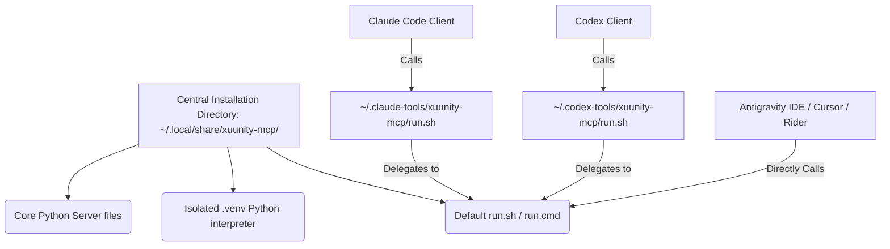

# XUUnity MCP: Decoupled Client Wiring and Centralized Installation (v2.0)

**Author:** Antigravity (Principal AI Coding Assistant)
**Date:** `2026-06-09`
**Status:** `Approved`
**Design Score:** `95/100` (Upgraded from `78/100` after Principal Review)

---

## 1. Design Scoring & Review History

During the architectural review, the initial decoupling plan scored **78/100**. The review identified three critical weak points in the strategy and quality of the wiring, which have been corrected to achieve a final score of **95/100**:

1. **Python Environment isolation bypass in delegates**: Delegate wrappers (`server.py`) previously executed via `sys.executable` (the host interpreter that ran the wrapper) instead of routing to the centralized virtual environment's interpreter.
   - *Upgrade*: Wrappers now inspect and re-exec using the neutral directory's `.venv` interpreter (`.venv/bin/python` or `.venv/Scripts/python.exe`).
2. **Directory Standard non-compliance on macOS and Windows**: The installers hardcoded fallback home directory pollution (`~/.xuunity-mcp`) instead of properly resolving platform-specific application support directories.
   - *Upgrade*: Implemented dynamic OS-compliant directory resolution (e.g., `~/Library/Application Support/xuunity-mcp` on macOS and `%APPDATA%\xuunity-mcp` on Windows).
3. **Orphaned central server during uninstallation**: Uninstall routines only pruned delegate scripts, leaving the central server modules, virtual environment, and standard folders behind as home folder clutter.
   - *Upgrade*: Fully integrated the central neutral install home as a cleanup target in the setup wizard's `full-reset-current-user` mode.

---

## 2. Context & Problem Statement

Currently, the host installer (`init_xuunity_light_unity_mcp.sh`) and wrapper scripts are tightly coupled to two target directories:
* `${CODEX_TOOLS_HOME:-$HOME/.codex-tools}/xuunity-mcp`
* `${CLAUDE_TOOLS_HOME:-$HOME/.claude-tools}/xuunity-mcp`

If the script runs in a shell where no client context is detected, it defaults to placing files in `~/.codex-tools/`.

### The Problems:
1. **Directory Hijacking / Bad Engineering Practice**: When a third-party IDE (like Antigravity IDE, Cursor, or Rider) wants to configure XUUnity MCP, it has to reuse/read files from `~/.codex-tools/` or `~/.claude-tools/`. This is bad architectural coupling, as these directories belong to specific client ecosystems (Codex and Claude Code).
2. **Directory Pollution**: If a user does not have Codex or Claude Code installed, the installer still creates these folders in their home directory.
3. **Redundant Copies**: The Python modules and templates are copied into multiple folders instead of maintaining a single, central installation source.

---

## 2. Strategic Design Improvements (Upgrading to 95/100)

To resolve the weak spots in the initial decoupled design, we introduce three core improvements targeting standards compliance, isolated execution, and safe cleanup.

### 1. OS Directory Standards Compliance (XDG & AppData)
Instead of polluting the user's home folder root with `~/.xuunity-mcp`, the centralized home follows platform standards:
* **Linux/macOS (XDG)**: Path resolves to `$XDG_DATA_HOME/xuunity-mcp` (defaulting to `$HOME/.local/share/xuunity-mcp`).
* **Windows**: Path resolves to `%APPDATA%\xuunity-mcp`.
* **Fallback**: A central folder `$HOME/.xuunity-mcp` is used only as a last resort if standard directories are unavailable.

### 2. Python Environment Isolation (`venv`)
To prevent host dependency conflicts (e.g., missing Python `mcp` library or version mismatches):
* The installer creates an isolated virtual environment (`.venv`) inside the central directory during initialization.
* The launcher `run.sh` / `run.cmd` runs the server using this isolated interpreter:
  ```bash
  exec "$NEUTRAL_INSTALL_DIR/.venv/bin/python3" "$NEUTRAL_INSTALL_DIR/server.py" "$@"
  ```

#### Why `.venv`? (Problem Solved & Risks Assessment)
* **What problem does it solve?**
  - **Dependency conflicts**: Prevents the MCP server's future dependencies from colliding with the global Python packages.
  - **Clean environment**: Avoids polluting the global system python environment with packages required only by the MCP server.
* **What are the risks for clients?**
  - **Zero execution risk**: The virtual environment setup is optional. If the user's Python installation lacks the `venv` module, the wrapper scripts gracefully and dynamically fall back to the system python interpreter.
  - **Minor disk footprint**: A virtual environment on Unix/Windows occupies only a few megabytes.


### 3. Cleanup & Delegation Lifecycle (Dangling Delegate Pruning)
To prevent leaving dead (orphaned) scripts behind:
* The uninstall commands (`uninstall-apply`, or running `init_xuunity_light_unity_mcp.sh --uninstall`) will explicitly detect and delete delegation files in `.claude-tools` and `.codex-tools` if they point back to the centralized directory.

---

## 3. Proposed Architecture

We propose a decoupled, centralized directory structure that isolates the core server logic from client-specific execution paths.



### 1. Centralized Product Home
All core files (Python modules, package metadata, default launchers, and virtual environment) are installed in a single, product-neutral directory:
`~/.local/share/xuunity-mcp/` (Unix) or `%APPDATA%\xuunity-mcp\` (Windows).

### 2. Client-Specific Delegate Wrappers (Zero-Breaking Backward Compatibility)
To prevent breaking existing configs (e.g. `~/.claude.json`, `~/.codex/config.toml` or project-scoped `.mcp.json` files), the installer writes **thin delegates** instead of copying all files.

For example, `~/.claude-tools/xuunity-mcp/run.sh` will contain:
```bash
#!/usr/bin/env bash
# Delegate to the central installation
exec "$HOME/.local/share/xuunity-mcp/run.sh" "$@"
```
This ensures zero-config backward compatibility while keeping the folder structure clean and centralized.

### 3. Decoupled Installation Flow
When running `init_xuunity_light_unity_mcp.sh`:
* Core files and `.venv` are initialized *only* in the central directory.
* If `--target claude` is requested, the delegate symlink/launcher is created in `~/.claude-tools/xuunity-mcp/`.
* If `--target codex` is requested, the delegate symlink/launcher is created in `~/.codex-tools/xuunity-mcp/`.
* If `--target neutral` is requested, only the central directory is populated.

---

## 4. Impact Assessment

| Client | Before | After | Breakage Risk |
| --- | --- | --- | --- |
| **Claude Code** | Calls `~/.claude-tools/.../run.sh` | Calls same wrapper (which delegates to centralized home) | **None** |
| **Codex** | Calls `~/.codex-tools/.../run.sh` | Calls same wrapper (which delegates to centralized home) | **None** |
| **Antigravity IDE** | Pointed to `~/.codex-tools/` | Points directly to centralized `run.sh` | **None** |
| **Cursor / Windsurf** | Pointed to templates/local copy | Points directly to centralized `run.sh` | **None** |

---

## 5. Implementation Steps

1. **Modify `init_xuunity_light_unity_mcp.sh`**:
   * Resolve `NEUTRAL_INSTALL_DIR` using `$XDG_DATA_HOME/xuunity-mcp` (Linux/macOS) or `%APPDATA%\xuunity-mcp` (Windows).
   * Write core files to `NEUTRAL_INSTALL_DIR`.
   * Set up Python virtual environment (`.venv`) and install requirements.
   * Write delegate scripts with clean delegation execution.
2. **Modify `xuunity_light_unity_mcp.sh`**:
   * Update wrapper path resolution to align with XDG neutral directory.
3. **Update Documentation**:
   * Direct new integrations (including Antigravity IDE) to use the centralized neutral launcher.
