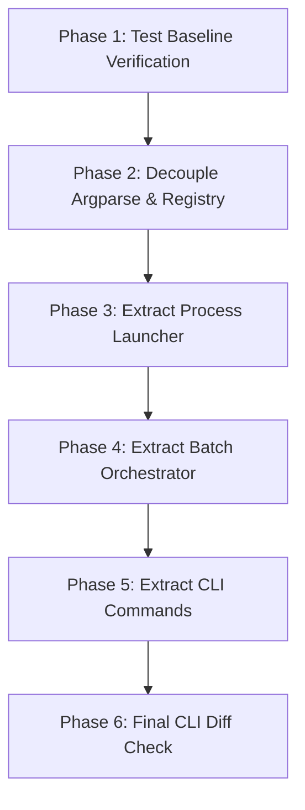

# Refactoring Design Plan: `templates/server.py`

- **Status**: Implemented & Verified
- **Date**: 2026-06-09
- **Author**: Principal Python Developer / Agent
- **Target File**: `templates/server.py`

---

## Executive Summary & Design Constraints

To maintain compatibility with light-weight client setups, we operate under two strict constraints:
1. **Zero External Runtime Dependencies**: The refactored CLI must continue to run using only the Python standard library (no `click`, `typer`, or `pydantic` runtime installs required).
2. **Backward CLI Compatibility**: Subcommands, options, and output JSON formats (stdout/stderr matching) must remain identical.

---

## Architectural Upgrades (Addressing the 3 Weak Spots)

### 1. Standard Argument Parser and DAG Subcommand Mapping
Instead of a complex decorator-based registry that would introduce cyclic dependencies (or bidirectional import loops) between parsing logic and commands, we implemented a clean top-down DAG (Directed Acyclic Graph) structure:
- `server_cli_commands.py` contains all subcommand handlers (`cmd_*` functions).
- `server_cli_parser.py` implements `build_parser()` and uses standard `argparse` configuration. It assigns handlers via `.set_defaults(func=cmd_...)`.
- `server.py` acts as a facade that executes the parser and routes command handler invocations directly using `args.func(args)`.

This keeps command registration simple, uses standard library features without extra layers, and ensures direct execution routing.

---

### 2. Portable Execution Host (`ProcessLauncher` Abstraction)
To resolve the brittle self-invocation via `sys.executable` and `__file__`, we introduce a central `ProcessLauncher` class in `server_process_launcher.py`.

```python
# templates/server_process_launcher.py
import sys
from pathlib import Path
from typing import List

class ProcessLauncher:
    @staticmethod
    def get_self_invocation_base_command() -> List[str]:
        """
        Determines the most portable command prefix to invoke the current server context.
        Handles script, freeze (PyInstaller), and module execution paths.
        """
        # Case A: PyInstaller / cx_Freeze compiled executable
        if getattr(sys, 'frozen', False):
            return [sys.executable]

        # Case B: Invoked as a python module (python -m com.xuunity.light-mcp)
        if __package__:
            return [sys.executable, "-m", __package__]

        # Case C: Direct script execution
        script_path = Path(sys.argv[0]).resolve()
        if script_path.name == "server.py" and script_path.is_file():
            return [sys.executable, str(script_path)]

        # Fallback to general execution
        main_file = Path(__file__).parent / "server.py"
        return [sys.executable, str(main_file.resolve())]
```
All self-invocations inside batch compilers or test swept runs will change from `[sys.executable, __file__, *args]` to `ProcessLauncher.get_self_invocation_base_command() + args`.

---

### 3. Strict Directed Acyclic Graph (DAG) Import Topology
To prevent circular dependencies during code extraction, the refactored modules will follow a strict top-down import flow.

```
       [server.py] (Entrypoint & System Exit handlers)
            │
            ▼
   [server_cli_parser.py] (Registry & Argparse Builder)
            │
            ▼
   [server_cli_commands.py] (Command Execution Handlers)
            │
            ▼
   [server_batch_orchestrator.py] (Batch & GUI execution engine)
            │
            ▼
   [Core Library Modules] (server_editor_host.py, server_discovery.py, etc.)
            │
            ▼
   [Leaf Utility Modules] (server_core.py, server_host_platform.py)
```

#### Import Isolation Rules:
- **No Upward Imports**: Core Library Modules (e.g., `server_editor_host.py`, `server_discovery.py`) are strictly prohibited from importing from `server_cli_commands.py`, `server_cli_parser.py`, or `server.py`.
- **Core Exceptions**: All shared models, decorators, and custom exceptions (e.g. `ToolInvocationError`) must live in the leaf module `server_core.py`.

---

## Phased Refactoring Strategy



### Phase 1: Test Baseline Verification
- Execute host python tests: `python3 -m unittest discover -s tests -v`.
- Capture a reference JSON output for key commands (e.g., `--help`, `project-discovery-report`).

### Phase 2: Decouple Argparse & Parser
- Create `templates/server_cli_parser.py`.
- Move the subcommand configuration definitions into standard `argparse` subparsers.
- Assign defaults via `.set_defaults(func=cmd_...)`.
- *Verification*: Confirm `python3 templates/server.py --help` matches the baseline exactly.

### Phase 3: Introduce `ProcessLauncher`
- Create `templates/server_process_launcher.py`.
- Replace all occurrences of `[sys.executable, __file__]` with `ProcessLauncher.get_self_invocation_base_command()`.
- *Verification*: Run `test_multi_project_batch_runner.py` and `test_batch_operator_ergonomics.py`.

### Phase 4: Extract Batch Orchestrator
- Create `templates/server_batch_orchestrator.py`.
- Move `run_batch_operation`, `run_gui_fallback_operation`, and `batch_lane_preflight_blocker` out of `templates/server.py`.
- Ensure imports follow the strict DAG topology.
- *Verification*: Run unit tests to confirm no circular dependencies are triggered.

### Phase 5: Extract Command Handlers & Compatibility Facade
- Create `templates/server_cli_commands.py`.
- Relocate all `cmd_*` handler functions here.
- Configure `templates/server.py` as entrypoint and compatibility facade. Expose functions, modules, and proxy wrappers for test-suite mock compatibility.

---

## Safety, Verification & Rollback Protocols

1. **Incremental Backup Rollbacks**:
   At each phase, a copy of the target file is saved (`cp templates/server.py templates/server.py.bak`).
   If a phase introduces circular dependencies or unit test failures that cannot be resolved in 15 minutes, execute:
   ```bash
   cp templates/server.py.bak templates/server.py
   ```

2. **Stdout/Stderr Matching (Equivalence Verification)**:
   A simple verification script should capture and diff output payloads:
   ```bash
   python3 templates/server.py project-discovery-report --project-root <path> > /tmp/refactored.json
   # Compare with baseline
   diff /tmp/baseline.json /tmp/refactored.json
   ```

3. **Subprocess Self-Invocation Test Coverage**:
   Run tests using alternative execution modes (e.g. executing the folder module `python3 -m templates.server`) to ensure the `ProcessLauncher` resolves executable targets successfully.
