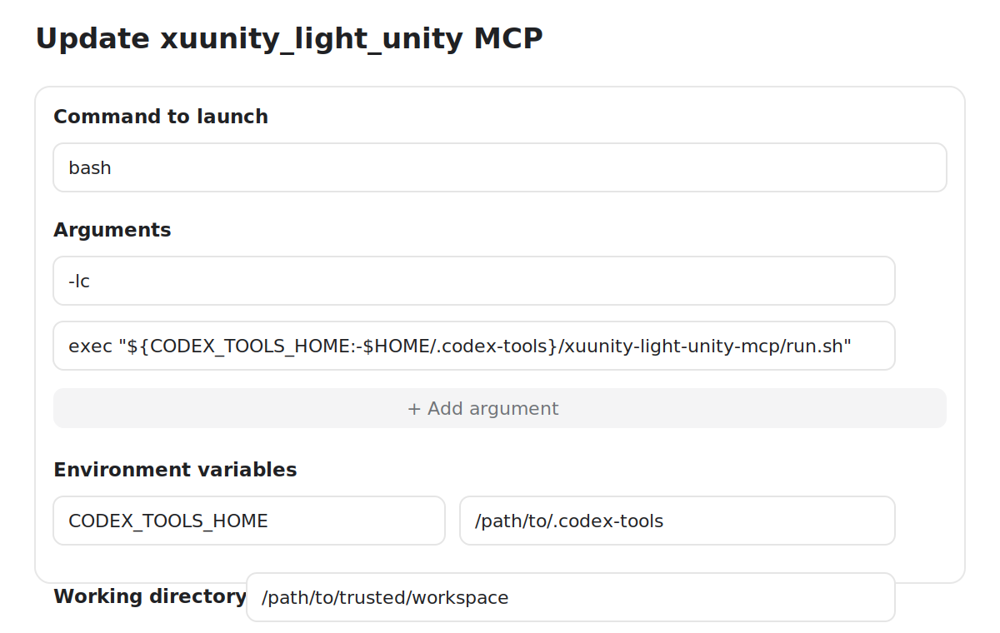
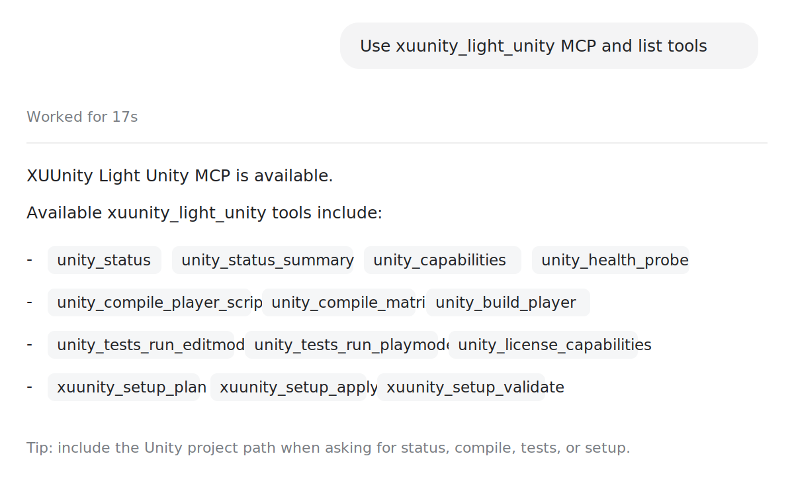

# Codex Unity MCP Setup

This guide shows how to connect XUUnity Light Unity MCP through the Codex
custom MCP server UI. Use this only on trusted local projects. If Rider, VS
Code, or another MCP client is also connected, avoid concurrent commands against
the same Unity project.

This visual setup only wires Codex to the host helper. It does not by itself
prove that a specific Unity project already has the MCP package dependency,
bridge config, or optional test capability enabled.

The images below are sanitized examples based on the Codex Desktop custom MCP
flow.

## Create The Server

In Codex, open `Settings > MCP servers > Add server`, then choose `STDIO`.

Use these values:

| Field | Value |
| --- | --- |
| Name | `xuunity_light_unity` |
| Command to launch | `bash` |
| Argument 1 | `-lc` |
| Argument 2 | `exec "${CODEX_TOOLS_HOME:-$HOME/.codex-tools}/xuunity-mcp/run_installed_or_refresh_xuunity_mcp.sh"` |
| Environment variable | `CODEX_TOOLS_HOME=/path/to/.codex-tools` if you do not want the default `$HOME/.codex-tools` |
| Working directory | `/path/to/trusted/workspace` |

On native Windows, use these values instead:

| Field | Value |
| --- | --- |
| Name | `xuunity_light_unity` |
| Command to launch | `cmd.exe` |
| Argument 1 | `/d` |
| Argument 2 | `/c` |
| Argument 3 | `call` |
| Argument 4 | `C:\Users\<YOUR_USERNAME>\.codex-tools\xuunity-mcp\run_installed_or_refresh_xuunity_mcp.cmd` |
| Working directory | `C:\path\to\trusted\workspace` |

Replace `<YOUR_USERNAME>` with your Windows user name (with a custom
`CODEX_TOOLS_HOME`, point argument 4 at `<CODEX_TOOLS_HOME>\xuunity-mcp\...`
instead). Keep every argument free of embedded quotes and parentheses:
clients quote argv with the C-runtime rules, which escape embedded quotes as
`\"` — cmd.exe misparses that and the server never starts.

Prefer the `.cmd` launcher for native Windows. PowerShell `.ps1` wrappers can
be blocked by ExecutionPolicy, and Git Bash is not the recommended setup route
for quoted Unity project paths that contain spaces.



The same setup in `~/.codex/config.toml` looks like this on Linux/macOS:

```toml
[mcp_servers.xuunity_light_unity]
command = "bash"
args = ["-lc", "exec \"${CODEX_TOOLS_HOME:-$HOME/.codex-tools}/xuunity-mcp/run_installed_or_refresh_xuunity_mcp.sh\""]
required = false
```

Install or update the host-side helper before using the server:

```bash
bash init_xuunity_light_unity_mcp.sh --target codex
```

If `${CODEX_TOOLS_HOME:-$HOME/.codex-tools}/xuunity-mcp/run_installed_or_refresh_xuunity_mcp.sh`
already exists, reuse that helper instead of cloning a fresh repo just to run
setup again.

If `~/.codex/config.toml` already contains
`[mcp_servers.xuunity_light_unity]`, verify or merge the existing block instead
of creating a duplicate entry through the UI or config file.

## Verify

Restart or refresh the Codex MCP server list, then ask Codex:

```text
Use xuunity_light_unity MCP and list tools.
```

You should see tools such as `unity_status`, `unity_status_summary`,
`unity_capabilities`, `unity_license_capabilities`, `unity_compile_matrix`,
`unity_tests_run_editmode`, `unity_tests_run_playmode`, and
`xuunity_setup_validate`.



For a real Unity project check, include the project path:

```text
Use xuunity_light_unity MCP to run unity_status_summary for /path/to/UnityProject.
```

If the bridge is not ready yet or this Codex session has not hot-reloaded the
MCP server yet, ask Codex to run the host helper checks first:

```text
Run xuunity_light_unity_mcp.sh validate-setup for /path/to/UnityProject, then run ensure-ready, wait for it to finish, and check request-status-summary. After Codex can see the MCP server, check unity_status_summary.
```

On native Windows, ask for the `.cmd` helper explicitly:

```text
Run xuunity_light_unity_mcp.cmd validate-setup for "C:\path with spaces\UnityProject", then run ensure-ready, wait for it to finish, and check request-status-summary. After Codex can see the MCP server, check unity_status_summary.
```

Run helper checks sequentially; do not start the status check before
`ensure-ready` finishes. Use `request-status-summary` as the first helper
verification when Codex has not loaded the MCP server yet. Treat
`unity_status_summary` as the canonical first live MCP-tool smoke-check after
setup. Only move on to tests or builds after it reports a healthy bridge, then
confirm `unity_capabilities` and `unity_health_probe`.

If those checks succeed but a later compile or test run fails, treat that as a
Unity project or runtime failure unless the error explicitly points back to MCP
setup or unsupported capability.

## Preflight Review In Codex

Before asking Codex to mutate a project or `~/.codex/config.toml`, require a
short review in chat. UI auto-review or sandbox approval is not a replacement
for that review.

Suggested review format:

```text
Preflight review
- Current client: Codex
- Wiring target: Codex
- Unity project root: <approved project root>
- Additional discovered Unity projects: <none or list>
- Existing helper install: <reuse existing helper | clone required>
- Existing Codex MCP block: <present | missing>
- Planned project file changes: <manifest, bridge config, lockfile, none>
- Planned user-level config changes: <exact file paths or none>
- Restart or refresh required after mutation: <yes/no>
- Planned commands after approval: <setup-apply, validate-setup, ensure-ready, request-status-summary, unity_status_summary after reload, ...>

Do not run setup-apply, installer commands, helper sync, or Codex config edits
until the user explicitly approves this review.
```

## Remove Or Reset In Codex

Ask Codex to plan removal before it deletes anything:

```text
Run xuunity_light_unity_mcp.sh uninstall-plan --mode project-only-cleanup --project-root /path/to/UnityProject, show the preflight review, and wait for approval before uninstall-apply.
```

For a Codex current-user reset, use:

```text
Run xuunity_light_unity_mcp.sh uninstall-plan --mode full-reset-current-user --client codex, include --project-root only if a project was named, show exact Codex config and helper removals, and wait for approval before uninstall-apply.
```

Project-only mode keeps `~/.codex/config.toml` and the Codex helper install. Full
reset removes only `[mcp_servers.xuunity_light_unity]` from Codex config and
the selected Codex helper install by default.

## How To Ask Codex

You do not need to spell out the MCP server name every time once the server is
connected. Natural requests are fine when they name the Unity project and the
operation clearly:

- `Run Unity status for /path/to/UnityProject.`
- `Run EditMode tests in /path/to/UnityProject.`
- `Compile Android player scripts for /path/to/UnityProject.`
- `Check XUUnity setup for /path/to/UnityProject, include tests.`

Mention `xuunity_light_unity` explicitly when you are verifying setup, when more
than one Unity-capable MCP server is configured, or when Codex chooses shell
commands instead of MCP tools. A vague request like `run tests` can be
ambiguous; a request that includes `Unity project root` plus `EditMode` or
`PlayMode` gives the agent enough context to pick the right tool.

If the editor is busy, compiling, importing, or in Play Mode, Codex may report a
busy-state error instead of forcing the operation. Return the editor to an idle
Edit Mode state, or ask for a recovery/status check first.
